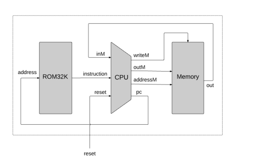
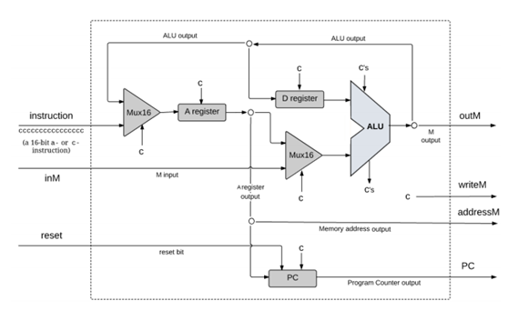
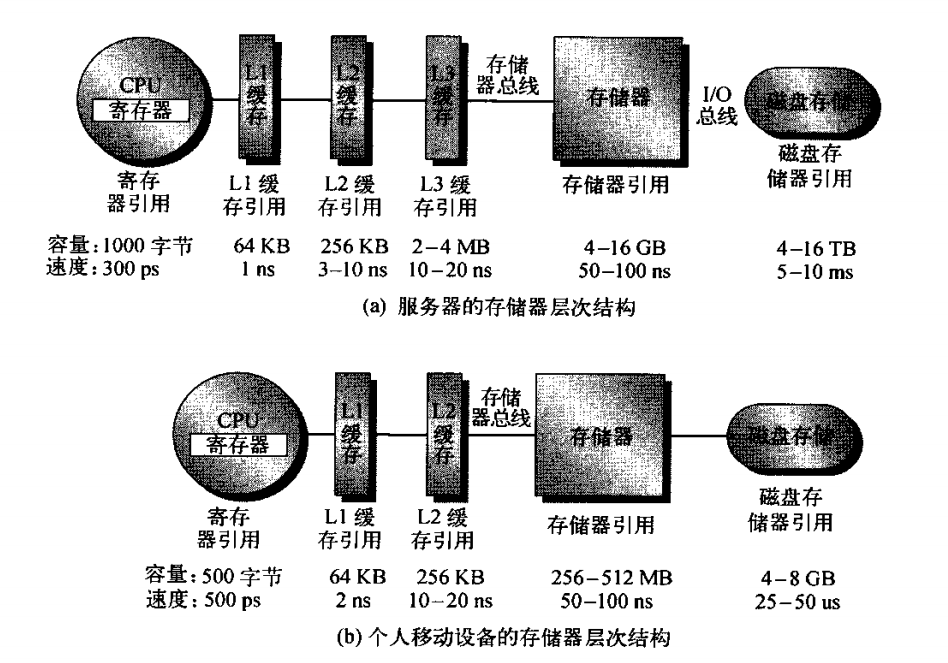
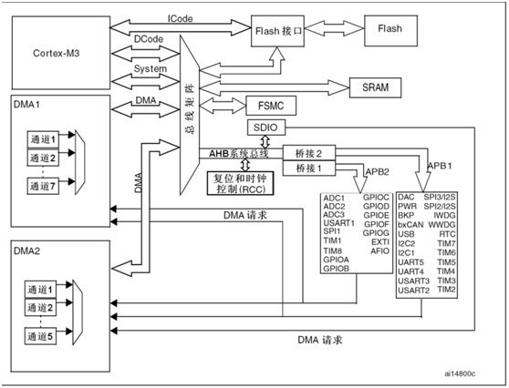

## CPU 结构

CPU 的功能？执行指令，处理数据。

要不要举加法器的例子？

instruction 部分，也就是指令部分，会发现其中的某些位用于控制，有些位表示数据。

PC 指针。

Write to Memory。

指令基于硬件实现，通过指令可以翻译为二进制数据，也可以通过二进制数据翻译为汇编指令，所以说汇编指令是不具备移植性的，它是完全取决于硬件来实现的。在这之上，也就出现了 C 语言，这是后话。

### 系统总线

由 CPU 控制的，用来传递数据到 CPU 的通信总线，区别在于可直接寻址。

### 时钟

时钟是用来同步的，而不是什么芯片的心脏的说法，就是提供一个时间的概念，时钟是由硬件提供的。

### 流水线

来看上面的 CPU 内部结构图，实际上如果从微观角度来看 CPU 的执行过程，CPU 中最慢的部件决定了 CPU 时钟的最大频率，指令级并行。

流水线实际上是让一条指令的执行变慢了，但是提高了指令吞吐量，而不是让指令执行变快了。

流水线的中间寄存器也是一个弊端，散热也是一个问题。

最猛的是 奔腾4 的 31 级流水线。

可以看出，主频不是一秒能执行多少条指令。

### 超标量、超线程

以空间换时间，也就是增加大量的硬件。

多核技术在后面说到。

### 缓存

缓存这个东西得好好讲讲。

京东。

为什么不直接用又快又大的存储器，在内存之前是因为价格，磁盘是因为要掉电保存，这是必须的。

缓存和优化会带来大量的问题。

## CPU 层次架构

上面讲了一个最简单的 CPU，讲了汇编、讲了指令，下面我们来讨论一下我们常说的 "芯片" 或者 "处理器"到底指什么？

其实，这两个概念已经变得非常模糊了。

我们所看到的 "芯片" 实际上指的是物理芯片，有时候我们也称之为处理器，实际上从设计制造上来说，它分了很多层。

* 第一层，指令集架构，比如 arm 的 armv7、armv8，指令集架构决定了什么呢？决定了指令，当然这是根据硬件进行设计的，决定了内部寄存器，决定了支持的缓存数量，决定了系统总线，决定了支持的处理器模式等等。
* 第二层，处理器，比如基于 armv7 的 cortex A7-A9，基于 armv8 的 A35、A52、A72，不同的处理器之间差别在哪儿呢？比如多核的设计、缓存的实现。
* 第三层，MPU，芯片厂商在处理器的基础上添加外设，比如各种硬件控制器、内存。

最后进行封装，这就是一个物理 CPU 的成型。

### cpu 是怎么实现复杂功能的

cortex-M3 是 armv7-M 的指令集架构。

讲讲 DMA？

### 程序的编译

上面说明了硬件汇编指令为什么是体系架构相关的？汇编代码几乎不能移植，也就出现了 C。实际上之前还有 FORTRAN、B 语言，这些都是编译型语言，也就是说，这些语言开始变得可移植。

编译器在其中起到关键作用。

预编译、编译、汇编、链接。

鉴于这里有很多对编译过程并不理解的朋友，细节就不提了，主要讲讲两个部分：分离编译、链接、以及指令数据的交互方式。 

分离编译：一个 .c 文件作为一个编译单元，这样的做好处在于模块化，如果全部文件放到一起编译，那么一个大型工程里面只要修改一个文件就全部编译一遍，那就太恐怖了。这样也比较有利于静态库和动态库的实现。

指令数据的交互方式：实际上，二进制指令通常会引用某些数据，或者调用某些程序，比如全局变量，这是很常见的，实际上在编译的时候就需要确定指令和数据被加载的地址，然后把程序放到对应的地址上，就可以运行。

而链接呢，一个程序有多个 C 文件，每个 C 文件都单独编译，因此最后需要进行汇总，把它们链接成一个程序，同时确定它的运行地址。

静态库和动态库，库应该不陌生了，其实库分为动态库和静态库两种，静态库比较简单，其实就是单个或多个 .C

 文件编译之后的集合，好处是简单，缺点在于臃肿，不灵活。

而动态库完美地解决了这个问题，动态库的实现技术相对要复杂一些，使用 PIC 代码，而且执行效率要稍微低一些。

我猜你们可能感兴趣但是又不大清楚的一个知识点是，为什么单片机烧写程序需要 hex 文件或者 bin 文件，而 linux 可以直接运行可执行文件。 

实际上在程序编译过程中以及编译最后生成的可执行文件，是一种 elf 格式的文件，看到格式这两个字，你应该就知道它是遵循了某些布局标准的文件，这并不是二进制文件，而是包含了很多可执行文件需要的信息，要执行这种可执行文件需要加载器。

但是单片机是没有加载器的，所以不能执行 linux 下的可执行文件，因此只能直接将二进制代码烧写到对应的地址处，一种是通过 jlink 烧写 hex 文件，hex 文件并不是二进制文件，而是以 16 进制字面值表示的二进制文件，这其中会经过 jlink 的解析，由 jlink 翻译成二进制文件烧录到对应位置，烧写完成之后也就直接执行这些代码了。

另一种呢，就是直接烧录 bin 文件，bin 文件是真正的二进制文件，在座的各位有没有做过单片机固件升级的，讲到这里你应该就知道了，为什么固件升级下进去的文件只能是 bin 文件而不能是其它的比如 hex 文件了，因为 hex 文件无法直接运行。

这里只是稍微讲一讲程序的编译、链接、动态库、静态库，后面如果谁有兴趣，我们再回过头来深入讨论这些过程的实现。 

### 内存布局

## 中断

程序按照我们编写的流程一步一步地向下执行，也就是一条道走到黑，但是程序是服务于现实的应用，这种模式并不能直接满足显示的应用，比如一天的计划，但是会有一些意外的情况发生更需要处理或者希望在某些时候发生某些事，也就有了中断。

这就是程序中的两大主体，程序主流程以及中断机制，不难想到，中断是一种通知机制，而程序主流程才是永恒的，理解这两个概念非常重要，写过软件代码的都清楚，当系统发生中断时，程序会自动跳转到中断服务子程序里面是吧，那这个跳转怎么实现呢？

好的，回到 CPU 结构这一页，来看看，程序执行的下一条指令由什么决定？PC 指针，那就修改 PC 指针不就行了，程序不就自动跳转到想要执行的代码处，中断通常是硬件上的机制，由 CPU 实现，也就是发生硬件中断的时候，硬件上强制修改 PC 指针的值。

至于发生中断后是怎么跳转到中断服务子程序的，这其实是一个复杂的过程，如果你们有兴趣，我们等下再讨论？

## 操作系统

操作系统看起来是一个复杂的概念，因为 windows、linux、安卓这些操作系统给人很复杂的感觉，我们来看看操作系统的定义是什么：操作系统是管理计算机硬件与软件资源的计算机程序。  

实际上，对于常见的说法就是：裸机和多任务系统，其实最核心的部分就两个：任务调度和内存管理。

任务调度也就是多线程，一个程序同时完成多项动作，尽管只是看起来同时，因为切换时间很短，所以人看起来就是同时的，一个线程负责一项工作，任务调度实际上也很简单，就像我们前面所说的，CPU 把一个任务挂起然后去执行另一个任务，说白了也是 PC 指针的切换，待执行的程序也就跟着切换了，只不过有一些环境操作需要跟着一起切换，就像你从写代码切换到发邮件一样，除了脑子里面的思维切换，还得打开邮件页面。

至于为什么需要内存管理，其实也很好理解，程序就是在内存里面运行的，程序需要对自己活动地这片场地进行规划，以免造成全部堆满导致程序无法正常运行的情况。

### MMU 是什么

想一想，如果我们需要在一个操作系统中运行两个程序怎么办，注意不是两个线程，而是两个进程？注意多线程是编写在一个程序中的，线程是调度单元，而不是资源控制单元，比如 QQ、微信、ps，如果在系统中要同时运行这些程序，不可能把这几个应用的代码写成一个程序，然后用多线程来实现吧。自然是每个应用对应一个或多个可执行文件，这就是多进程的需求由来。

好，这下我们再回过头来看看程序是怎么编译运行的，在程序的链接过程中，通常就会指定程序需要加载到哪个地方，然后程序加载到对应地址，程序得以正常运行。好，现在出现两个进程，怎么给它们分配地址呢？

在早期的时候，苦逼的程序员手动地对地址进行分配，也就是说，程序 A 让它运行在 a 地址，程序 B 运行在 b 地址，只要做到两者进水不犯河水，CPU 照样可以通过切换线程一下轮流让这两个进程运行，也算是同时运行了两个进程。但是这存在很大的问题，不能动态地加载多个进程，随意变换地址。

这个问题的答案就是 MMU。

MMU 将物理地址隐藏在幕后，提供给每个进程虚拟地址的概念，每个进程可以运行一个程序，而且在编译时每个程序都可以使用同样的虚拟地址，MMU 负责将虚拟地址转换为物理地址，尽管每个进程虚拟地址可能重合，但是实际的物理地址并不冲突。

当程序加载到虚拟地址时，访问这个地址时，实际上会将虚拟地址发送给 MMU，然后 MMU 通过查表找到对应的物理地址，再将物理地址上的数据返回。

因此，带有 MMU 的 MPU 是可以实现隔离地运行所有进程的。

### 竞争问题

# linux

其实这次培训的主角应该是 linux 的，只是我觉得如果只是讲 linux 的话可能很多东西根本将不明白，因此讲到前面这么多的铺垫知识，包括从单片机到 rtos 到桌面操作系统。

其实我也不大喜欢讲应用的东西，一个是我也不是很懂应用，二个是讲应用没什么意义，本身如果要研究 linux，就应该研究它的实现原理和底层的机制，从原理出发，才能更好地理解和使用这个操作系统。

在 linux 中，所有硬件操作都由内核完成。

操作系统内核部分可以看成是躺在内核中等待调用的静态代码。

## linux 的启动流程

我所要讲的启动流程呢，其实不只是 linux 内核的启动流程，而是从嵌入式开发板上电那一刻，到最后用户的登陆整个流程，这个流程其实相对来说还是有些复杂的。整个流程是  bootrom->SPL(option)->u-boot->kernel->initramfs(option)->用户空间。

 

### bootrom

第一个问题：板子上电之后的第一条指令是怎么运行的？

这个问题其实并不是想当然的简单，这里有几个问题：

* 程序运行在哪里？内存？flash？
* 程序运行的环境，第一条指令执行的时候，C 语言的环境并没有建立，整个系统都没有初始化完成，比如看门狗，不能使用 C 编程，只能使用汇编。

实际上第一条指令运行在 norflash 中，norflash 的特性是 读+执行。

0 地址处的 norflash 在现代处理器的设计中通常是厂商固化的代码，比如 imx8 中，一块出厂的芯片，就可以连上 USB3.0 接口烧录 emmc，因此，可以猜测，厂商固化代码中包含的：处理器初始化程序+USB驱动+emmc驱动+烧录应用程序+根据拨码开关默认启动存储器上。

### SPL、U-boot

Uboot 是裸机代码。Uboot 中的网络。

imx8 的 bootloader 部分分了两级：SPL 和 Uboot。其实也就是为了加载内核，为什么要分成两个部分？

原来就只需要 uboot，现在为什么要加一个 SPL，也就是加载一个内核而已。

首先这里的一个背景知识是，SRAM 是不需要初始化就可以使用的，而 DRAM 或者 DDR 是需要进行配置才可以使用的，那么，其实在系统启动之初，DDR 是不能使用的，那么，厂商会在处理器上挂一个 SRAM，用于启动的时候执行程序用。

经过这么多年的发展，Uboot 功能越来越强大，换一句话说，Uboot 越来越庞大，那 SRAM 是不是需要也跟着一起增大呢？其实这是划不来的，因为 SRAM 很贵，所以我可以用一个小一点的 SRAM，让程序的初始化分步走，第一部分也就是 SPL 将串口、DDR 的初始化先做好，第二部分 UBOOT 不用再做这些事，自然也就装得下了，这就是 SPL 和 Uboot 之间的关系。

不过说到底，不管 Uboot 做得多么的强大，对于我们而言始终还是一件事：加载内核，具体的分为三个部分：

* 将内核镜像加载到 DDR 的某个地址处
* 将 dtb 设备树文件加载到  DDR 的某个地址处
* 修改 dtb 中的 bootargs，将 dtb 地址放在寄存器中
* 跳转到内核镜像

问题：在 uboot 串口初始化之前，想要调试程序，怎么做？

### 内核镜像

如果你编译过内核，可能会发现内核镜像有好几种类型，什么 Image、zImage、bzImage、uImage。

Image：没什么特点，就是内核镜像

zImage：压缩的内核镜像

bzImage：压缩的内核镜像，只是比较大

uImage：添加了一个头部，给 uboot 使用的，头部中包含了 Image 的大小、内核版本、加载位置等等，根据启动情况而定的一个东西。

内核的启动：

* 如果是 zImage 或者 bzImage，先是自解压，自解压就是把自己解压，然后把自己拷贝到正确的内存地址上。
* 执行内核代码，内核代码的初期依旧是汇编代码，因为这个时候 C 语言环境还没有初始化完成，同时有些操作 C 语言也做不了
* 因为初始化工作实际上已经被 uboot 完成一部分，因此内核启动的第一步实际上是开 MMU。
* 初始化系统，包括内存管理系统，调度系统，网络子系统，各类硬件控制器等等。
* 初始化硬件完成之后，创建内核管理线程，然后挂载根文件系统。 

### initramfs

我估计很多朋友都没有听过这个东西，实际上这是一个临时根文件系统，为什么在 rootfs 之前又搞出来一个临时根文件系统？

来看下面一些场景：

* 使用加密的 rootfs，当然是为了安全
* rootfs 在 pcie、usb、sdio 等不同接口的磁盘中，linux 是支持很多中启动介质的
* 如果因为意外断电导致根文件系统的损坏，这会直接导致 linux 系统无法启动，当然，运气好可能可以起来，这取决于系统文件有没有被损坏，如果使用一个临时的根文件系统，intramfs 可以检查并修复 rootfs，避免这种情况。
* 厂商不想开源自己的驱动代码，因为如果编译到内核就需要开源驱动代码。

initramfs 就是为了解决上述这些问题，ubuntu18.04 - x86-64 中就应用了 initramfs。 

### rootfs

挂载根文件系统之后，就是启动传说中的 init 进程了，应用工程师总是以为 linux 中的 init 进程就是系统的第一个进程，其实它只是用户空间的第一个进程。 

用户空间的进程管理。

init 系统。

sysvinit，最早占据主要市场的 init 系统，问题在于：

* 对热插拔的支持不好
* 串行启动，启动速度非常慢

Upstart：

* 支持热插拔
* 采用并行启动

systemd：

* 更快的启动速度，在 Upstart 的并行启动基础上采用了更激进的策略以及支持按需加载，同时保证稳定启动
* 接管了大量的服务，同时还在持续的更新中，比如 crond、udev 等独立于主进程的服务，统一了各个服务的管理接口以及日志系统，这种统一无疑让系统管理变得简单。   

有更大的梦想，但是备受争议。

